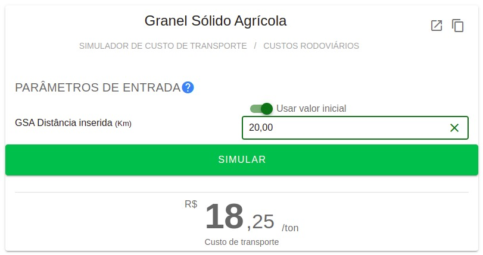

```{r setup, include=FALSE}
knitr::opts_chunk$set(echo = TRUE)
```

## Construindo a fórmula do custo de transporte

A fim de simular de maneira mais acurada os custos de transporte, coletamos dados do site <https://www.infrasa.gov.br/simuladores>

```{r echo=FALSE, align = 'center'}

```

A categoria que escolhemos para a simulação foi: "Custos Rodoviários - Granel Sólido Agrícola".

```{r echo=FALSE}

```

Assim, raspamos alguns dados (manualmente) desse site. Veja que o valor de entrada é uma distância (em quilômetros), e a saída é o valor do frete (em reais por tonelada).

```{r echo=FALSE}

```

Foram simulados custos de frete para as seguintes distâncias:

```{r}
distancia_km <- c(1, 2, 3, 4, 10, 15, 20, 25,
          30, 40, 50, 60, 70, 80, 90,
          100, 125, 150, 175, 200, 250,
          300, 350, 400, 450, 500, 550,
          600, 650, 700, 750, 800, 850,
          900, 950, 1000)

frete_reais_por_tonelada <- c(15.42, 15.57, 15.72, 15.87, 16.76, 17.51, 18.25, 19,
           19.74, 21.23, 22.72, 24.21, 25.71, 27.20, 28.69,
           30.18, 33.90, 37.63, 41.36, 45.08, 52.54, 
           59.99, 67.44, 74.90, 82.35, 89.80, 97.26, 
           104.71, 112.16, 119.62, 127.07, 134.52, 141.98,
           149.43, 156.88, 164.34)

distancia_km
```

Abaixo está uma tabela com os valores de frete simulados para cada distância:

```{r echo=FALSE}
dados <- data.frame(distancia_km, frete_reais_por_tonelada)

DT::datatable(dados, options = list(scrollX = TRUE))
```

Podemos também plotar esses dados em um gráfico, e vemos que existe um comportamente linear:

```{r}
ggplot2::ggplot(
  data = dados,
  ggplot2::aes(x = distancia_km, y = frete_reais_por_tonelada)
) + 
  ggplot2::geom_point()
```

Para descobrir qual é o função que gera os dados, podemos fazer uma regressão linear com $y = frete$ e $x = distancia$:

```{r}
lm(frete_reais_por_tonelada ~ distancia_km, data = dados)
```

Sendo assim, temos uma função $f(x) = 15.2709 + 0.1491x$

```{r}
f <- function(x){
  (0.1491*x + 15.2709)
}

```

Porém, para a parametrização do algoritmo, nós queremos um fator ($Transp$), em Reais/Tonelada/Quilômetro, e não só Reais/Tonelada.

Dessa maneira, a nossa função de interesse é:

```{r}
reais_ton_km <- frete_reais_por_tonelada/distancia_km

dados2 <- data.frame(distancia_km, reais_ton_km)

ggplot2::ggplot(
  data = dados2,
  ggplot2::aes(x = distancia_km, y = reais_ton_km)
) + 
  ggplot2::geom_point()
```

E podemos derivar essa função a partir da função que já obtivemos acima. Note que agora a nossa função de interesse é $g(x) = f(x)/x$, sendo $f$ a função já obtida.

Dessa maneira, temos que $g(x) = (15.2709 + 0.1491x)/x$, sendo $x$ uma distância e $g(x)$ um valor em reais/ton/km, como queríamos.

```{r}
g <- function(x){
  (0.1491*x + 15.2709)/x
}

```

Vamos plotar as funções $f$ e $g$ em cima dos pontos obtidos pelo site:

```{r}
ggplot2::ggplot(dados, ggplot2::aes(distancia_km)) +
  ggplot2::stat_function(fun=f) + 
  ggplot2::geom_point(ggplot2::aes(distancia_km, frete_reais_por_tonelada))
```

```{r}
ggplot2::ggplot(dados2, ggplot2::aes(distancia_km)) +
  ggplot2::stat_function(fun=g) + 
  ggplot2::geom_point(ggplot2::aes(distancia_km, reais_ton_km))
```
